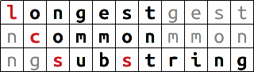

<p align="center">
    
</p>
<h1 align="center">go-lcss</h1>
<p align="center">
      Fast Longest Common Substring algorithm in Go.<br><br>
      <a href="http://godoc.org/gopkg.in/vmarkovtsev/go-lcss.v1"></a>
      <a href="https://travis-ci.org/vmarkovtsev/go-lcss"></a>
      <a href="https://codecov.io/gh/vmarkovtsev/go-lcss"></a>
      <a href="https://goreportcard.com/report/github.com/vmarkovtsev/go-lcss"></a>
      <a href="https://opensource.org/licenses/Apache-2.0"></a>
</p>
<p align="center">
  <a href="#overview">Overview</a> •
  <a href="#how-to-use">How To Use</a> •
  <a href="#installation">Installation</a> •
  <a href="#contributions">Contributions</a> •
  <a href="#license">License</a>
</p>

--------

## Overview

[Longest Common Substring](https://en.wikipedia.org/wiki/Longest_common_substring_problem)
(don't confuse with Longest Common Subsequence) is
a well-known computer science problem of finding the longest substring which appears in all
the given strings. It can be efficiently solved in log-linear time and linear space.
The implemented algorithm uses the code to build [suffix arrays](https://en.wikipedia.org/wiki/Suffix_array)
which was copy-pasted from the Go's standard library - it
is internal to `index/suffixarray` and unfortunately cannot be invoked directly.
There is a [blog post](https://www.roman10.net/2012/03/16/suffix-array-part-3-longest-common-substring-lcs/)
which gives some general understanding of that algorithm, though the actual implementation is quite different
(and optimized).

## How To Use

There are two functions: "basic" and "advanced". The former is straightforward:

```go
import "gopkg.in/vmarkovtsev/go-lcss.v1"

lcss.LongestCommonSubstring([]byte("ABABC"), []byte("BABCA"), []byte("ABCBA"))
// []byte("ABC")
```

The "advanced" function allows to cache the suffix arrays. It can be useful since the construction
of suffix arrays dominates over the run time of the algorithm:

```go

import "gopkg.in/vmarkovtsev/go-lcss.v1"

s1, s2, s3 := []byte("ABABC"), []byte("BABCA"), []byte("ABCBA")
lcss.LongestCommonSubstringWithSuffixArrays(
	[][]byte{s1, s2, s3},
	[][]int{lcss.Qsufsort(s1), lcss.Qsufsort(s2), lcss.Qsufsort(s3)})
// []byte("ABC")
```

## Installation

```
go get gopkg.in/vmarkovtsev/go-lcss.v1
```

The code supports building under Go >= 1.8.

## Contributions

...are pretty much welcome! See [contributing.md](contributing.md) and [code_of_conduct.md](code_of_conduct.md).

## License

Apache 2.0, see [LICENSE](LICENSE). It allows you to use this code in proprietary projects.